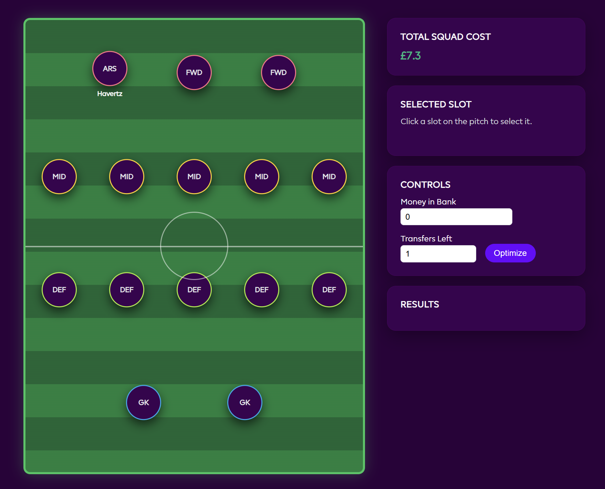

# ⚽ FPL Transfer Optimizer

A full-stack web application that helps Fantasy Premier League managers make smarter transfer decisions using real-time player data, a custom scoring engine, and a live interactive pitch UI.



---

## Features

- **Interactive pitch layout** — visualise your 15-player squad in a real formation view; click any slot to select and manage that position
- **Real-time player data** — fetches live stats directly from the FPL public API (form, points, price, fixtures)
- **Custom scoring engine** — ranks transfer candidates by weighing form, upcoming fixture difficulty, value for money, and position-specific metrics
- **Budget & transfer constraints** — input your available money in bank and transfers remaining; the optimizer respects both
- **Squad cost tracker** — live total squad valuation displayed as you build or modify your team
- **Position-aware suggestions** — recommendations are filtered by position (GK, DEF, MID, FWD) and squad rules (max 3 per club, etc.)

---

## Tech Stack

| Layer | Technology |
|---|---|
| Backend | Node.js, Express |
| Frontend | HTML, CSS, Vanilla JavaScript |
| Data | FPL Official API (public) |
| Hosting | Localhost / deployable to any Node host |

---

## Getting Started

### Prerequisites

- Node.js v16 or higher
- npm

### Installation

```bash
# Clone the repository
git clone https://github.com/ayushyaligar/fpl-transfer-optimizer.git
cd fpl-transfer-optimizer

# Install dependencies
npm install
```

### Running the app

```bash
npm start
```

Then open your browser and go to:

```
http://localhost:3000
```

---

## How It Works

### 1. Data fetching
The Express backend calls the FPL public API endpoints to pull current player stats — price, total points, form (last 5 GW average), and upcoming fixture difficulty ratings (FDR).

### 2. Scoring algorithm
Each candidate player is scored using a weighted formula:

```
score = (form × 0.4) + (points_per_million × 0.3) + (fixture_ease × 0.2) + (ownership_delta × 0.1)
```

Weights are tunable in `scoring.js`.

### 3. Transfer suggestion
Given your current squad, money in bank, and transfers left, the engine:
- Identifies your weakest player in each position by score
- Finds the best affordable replacement not already in your squad
- Ranks suggestions by score gain per transfer used

### 4. Pitch UI
The frontend renders your squad on an interactive pitch. Click a player slot to see that position's top transfer targets in the Results panel.

---

## Project Structure

```
fpl-transfer-optimizer/
├── server.js          # Express server & API routes
├── scoring.js         # Custom scoring & optimization engine
├── public/
│   ├── index.html     # Main UI
│   ├── style.css      # Pitch layout & dark theme
│   └── app.js         # Frontend logic & pitch rendering
├── package.json
└── README.md
```

---

## Screenshots

| Pitch View | Transfer Suggestions |
|---|---|
| Interactive squad layout with position slots | Ranked player recommendations with score delta |

---

## Roadmap

- [ ] Captaincy optimizer (best captain pick by fixture + form)
- [ ] Wildcard planner (full 15-player squad rebuild)
- [ ] Gameweek chip advisor (bench boost, free hit timing)
- [ ] Historical GW performance charts
- [ ] Login with FPL account to auto-load your current squad

---

## Contributing

Pull requests are welcome. For major changes, please open an issue first to discuss what you'd like to change.

---

## License

[MIT](./LICENSE)

---

## Author

**Ayush Yaligar**  
B.E. Computer Science — KLE Technological University  
[github.com/ayushyaligar](https://github.com/ayushyaligar)
